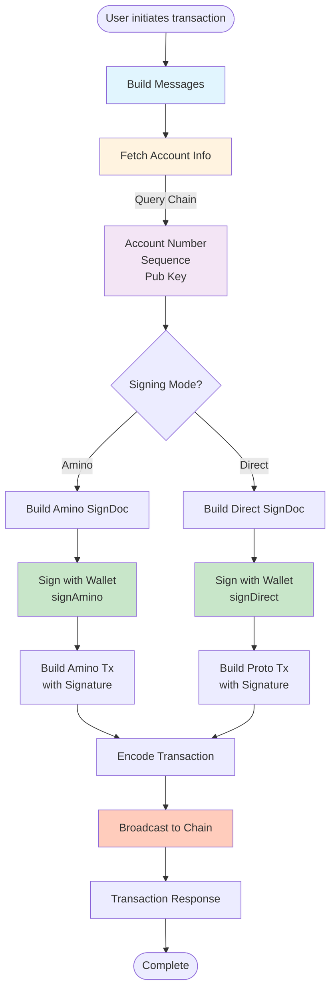
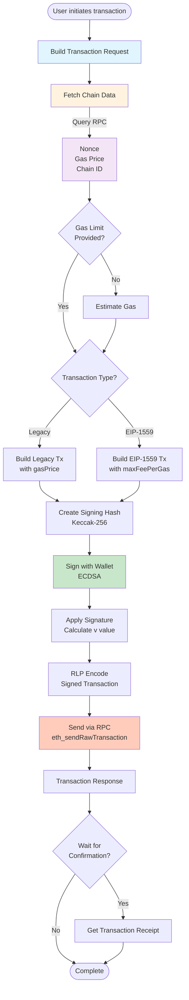
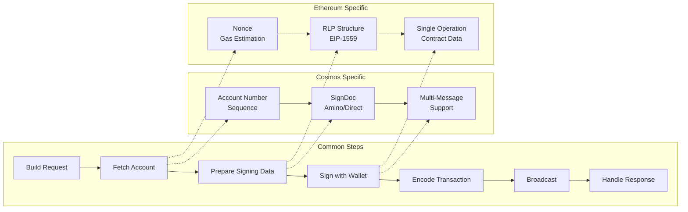
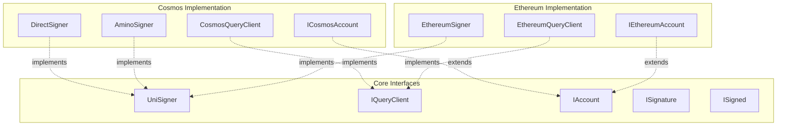
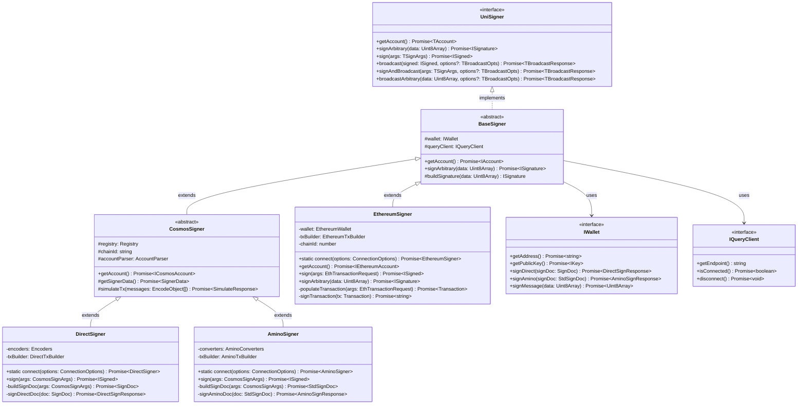
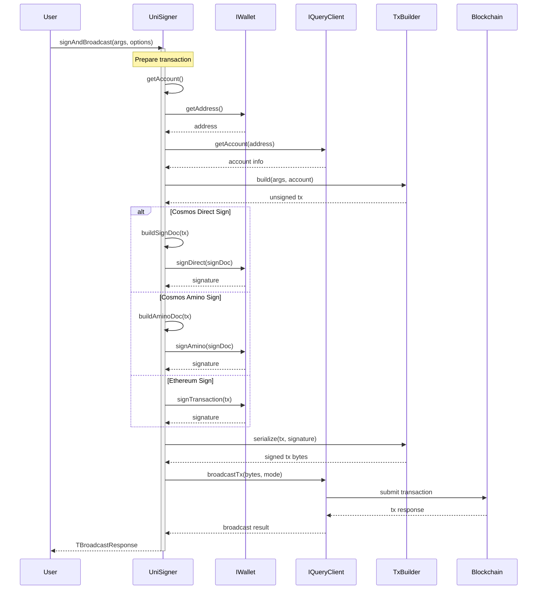
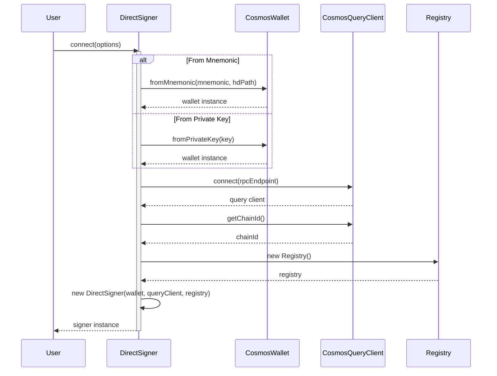
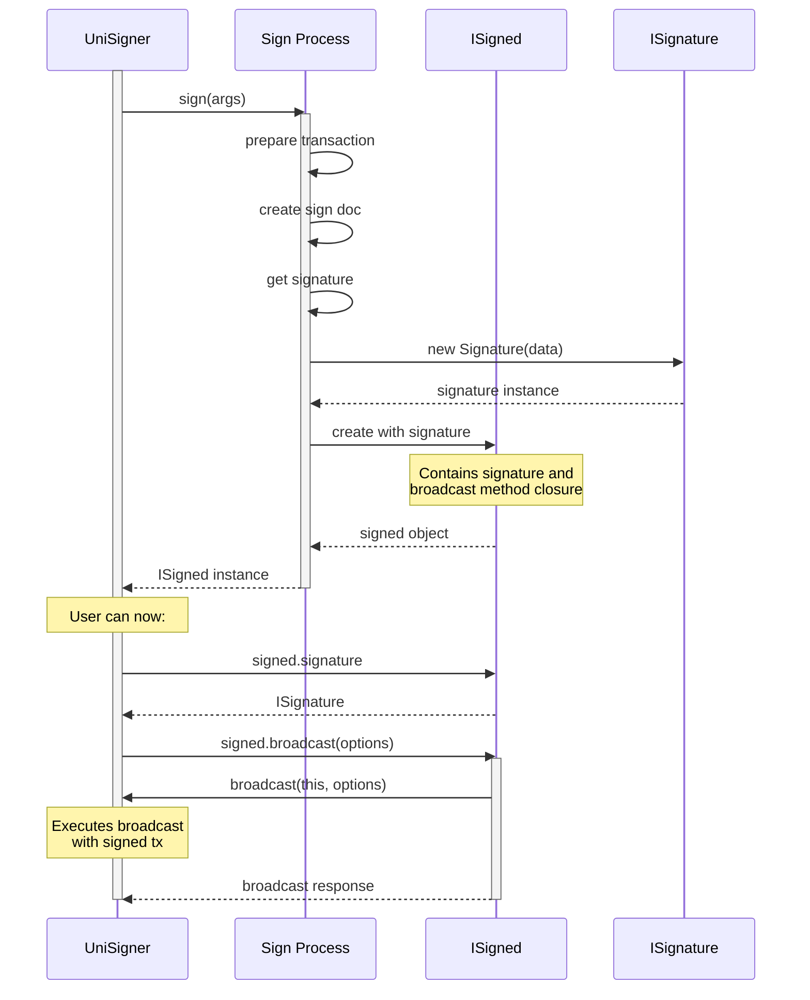
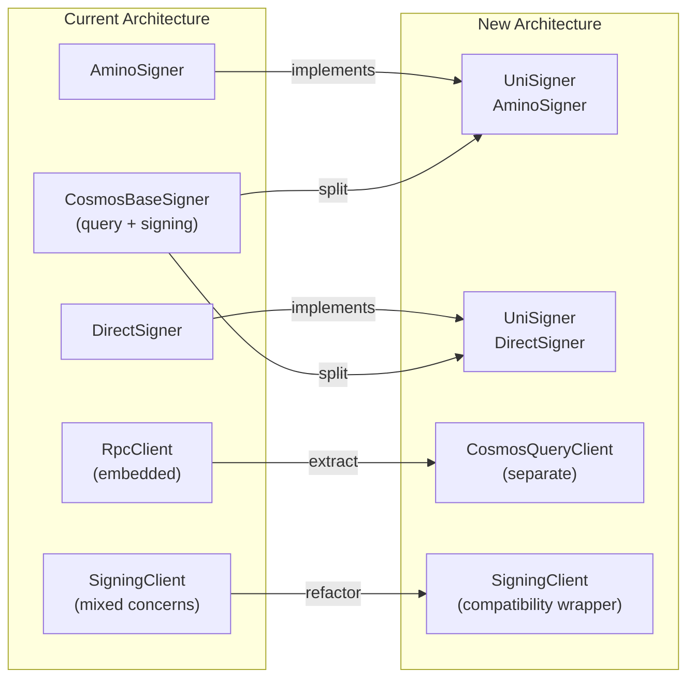
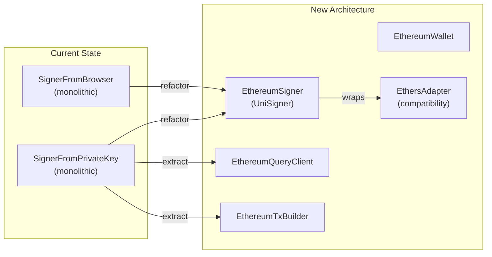

# InterchainJS Architecture

## Overview

InterchainJS provides a unified signing interface for multiple blockchain networks. This document outlines the architecture for a consistent abstraction layer across different chains, starting with Cosmos and Ethereum, with extensibility for future chains like Bitcoin and Solana.

## Design Principles

1. **Chain-Agnostic**: Core interfaces work across all blockchain types
2. **Type-Safe**: Leverage TypeScript generics for compile-time safety
3. **Composable**: Each operation is independently usable
4. **Backward Compatible**: Integrates with existing ecosystem tools
5. **Extensible**: Easy to add new chains without breaking existing implementations
6. **Separation of Concerns**: Clear boundaries between signing, querying, and wallet management

## Core Architecture

### Concepts

#### Account
Represents the identity and state of a blockchain address.

**Cosmos:**
- **Address**: Bech32-encoded (e.g., `cosmos1...`), derived from public key
- **Account Number**: Unique identifier assigned by the chain when account first receives funds
- **Sequence**: Transaction counter, increments with each transaction to prevent replay attacks
- **Public Key**: Required for first transaction, stored on-chain afterward
- **Key Types**: Supports secp256k1, ed25519

**Ethereum:**
- **Address**: Hex-encoded (e.g., `0x...`), derived from public key via Keccak-256
- **Nonce**: Transaction counter, similar to Cosmos sequence
- **Balance**: Native currency balance (not typically part of account info in Cosmos)
- **Chain ID**: Network identifier to prevent cross-chain replay attacks
- **Key Type**: Only secp256k1

**Overlap**: Both use address, transaction counters (sequence/nonce), and public key cryptography.

#### Transaction (Tx)
The signed data structure submitted to the blockchain.

**Cosmos:**
- **Messages**: Array of typed operations (e.g., MsgSend, MsgDelegate)
- **Fee**: Explicit fee with amount and gas limit
- **Memo**: Optional metadata field
- **Signatures**: Can have multiple signers
- **Format**: Protobuf or Amino JSON encoding

**Ethereum:**
- **Single Operation**: One action per transaction (transfer, contract call)
- **Gas**: Gas limit and price (legacy) or EIP-1559 fee parameters
- **Data**: Contract call data or empty for transfers
- **Value**: Amount of ETH to transfer
- **Format**: RLP encoding

**Overlap**: Both have fees/gas, signatures, and encode operations, but Cosmos supports batching.

#### Sign Document (Doc)
The data structure that gets signed before becoming a transaction.

**Cosmos:**
- **Direct SignDoc**: Protobuf structure with raw bytes
  - Body bytes (messages, memo, timeout)
  - Auth info bytes (signer infos, fee)
  - Chain ID
  - Account number
- **Amino SignDoc**: JSON structure for legacy compatibility
  - Human-readable message representation
  - Same logical content as Direct

**Ethereum:**
- **Transaction Object**: Pre-signature transaction
  - To, value, data, nonce
  - Gas parameters
  - Chain ID (post-EIP-155)
- **Signing Hash**: Keccak-256 of RLP-encoded transaction

**Overlap**: Both separate signing data from broadcast format and include chain-specific replay protection.

#### Signature
Cryptographic proof of transaction authorization.

**Cosmos:**
- **Format**: Compact 64-byte signature (r,s values)
- **Recovery ID**: Not included (public key provided separately)
- **Encoding**: Base64 in JSON, raw bytes in Protobuf
- **Multiple Signatures**: Supported for multi-sig accounts

**Ethereum:**
- **Format**: 65-byte signature (r,s,v values)
- **Recovery ID**: Included as 'v' value for public key recovery
- **Encoding**: Hex string or raw bytes
- **EIP-155**: v includes chain ID for replay protection

**Overlap**: Both use ECDSA signatures but with different recovery mechanisms.

#### Broadcast Response
Result of submitting a transaction to the network.

**Cosmos:**
- **Transaction Hash**: Hex-encoded SHA-256 of transaction bytes
- **Height**: Block number where transaction was included
- **Gas Used/Wanted**: Actual vs. requested gas consumption
- **Events**: Structured event logs from message execution
- **Code**: Error code (0 = success)

**Ethereum:**
- **Transaction Hash**: Hex-encoded Keccak-256 hash
- **Block Number**: Height where transaction was mined
- **Gas Used**: Actual gas consumed
- **Status**: Binary success/failure (1/0)
- **Logs**: Event logs from contract execution

**Overlap**: Both return transaction hash, block height, gas usage, and execution logs.

### Workflow

#### Cosmos Signing Workflow



#### Ethereum Signing Workflow



#### Unified Signing Flow Comparison



### Component Overview



### Signer Class Diagram



### Sequence Diagrams

#### Sign and Broadcast Flow



#### Connection Flow



#### Signature Creation Flow



## Core Interfaces

### IAccount - Base Account Interface

```typescript
/**
 * Base account interface common across all chains
 */
interface IAccount {
  /** Chain-specific address format */
  address: string;

  /** Optional public key */
  pubkey?: IKey;

  /** Key algorithm (secp256k1, ed25519, etc.) */
  algo?: string;
}

/**
 * Cosmos-specific account information
 */
interface ICosmosAccount extends IAccount {
  /** On-chain account number */
  accountNumber: bigint;

  /** Current sequence number */
  sequence: bigint;

  /** Public key (required for Cosmos) */
  pubkey: IKey;
}

/**
 * Ethereum-specific account information
 */
interface IEthereumAccount extends IAccount {
  /** Current nonce */
  nonce?: bigint;

  /** Chain ID */
  chainId: number;
}
```

### ISignature - Unified Signature Interface

```typescript
/**
 * Universal signature interface
 */
interface ISignature {
  /** Raw signature bytes */
  data: Uint8Array;

  /** Verify signature against message and public key */
  verify(message: Uint8Array, publicKey: IKey): Promise<boolean>;

  /** Convert to hex string */
  toHex(): string;

  /** Convert to base64 string */
  toBase64(): string;
}
```

### ISigned - Signed Transaction Interface

```typescript
/**
 * Represents a signed transaction with broadcast capability
 */
interface ISigned<BroadcastOpts, BroadcastResponse> {
  /** The signature */
  signature: ISignature;

  /** Built-in broadcast method */
  broadcast(options?: BroadcastOpts): Promise<BroadcastResponse>;
}
```

### IBroadcastResult - Unified Broadcast Response

```typescript
/**
 * Common broadcast result across all chains
 */
interface IBroadcastResult {
  /** Universal transaction identifier */
  transactionHash: string;

  /** Original chain response preserved */
  rawResponse: unknown;
}
```

### UniSigner - Universal Signer Interface

```typescript
/**
 * Universal signer interface for all blockchain networks
 */
interface UniSigner<
  TAccount extends IAccount = IAccount,
  TSignArgs = unknown,
  TBroadcastOpts extends IBroadcastOptions = IBroadcastOptions,
  TBroadcastResponse extends IBroadcastResult = IBroadcastResult
> {
  /**
   * Get account information including address and chain-specific details
   */
  getAccount(): Promise<TAccount>;

  /**
   * Sign arbitrary data (for message signing)
   */
  signArbitrary(data: Uint8Array): Promise<ISignature>;

  /**
   * Sign a transaction with chain-specific arguments
   * @returns ISigned object with signature and broadcast capability
   */
  sign(args: TSignArgs): Promise<ISigned<TBroadcastOpts, TBroadcastResponse>>;

  /**
   * Broadcast a signed transaction
   */
  broadcast(
    signed: ISigned<TBroadcastOpts, TBroadcastResponse>,
    options?: TBroadcastOpts
  ): Promise<TBroadcastResponse>;

  /**
   * Sign and broadcast in one operation
   */
  signAndBroadcast(
    args: TSignArgs,
    options?: TBroadcastOpts
  ): Promise<TBroadcastResponse>;

  /**
   * Broadcast pre-signed transaction bytes
   */
  broadcastArbitrary(
    data: Uint8Array,
    options?: TBroadcastOpts
  ): Promise<TBroadcastResponse>;
}
```

### IQueryClient - Query Interface

```typescript
/**
 * Base query client interface
 */
interface IQueryClient {
  /** Get the RPC endpoint */
  getEndpoint(): string;

  /** Check if client is connected */
  isConnected(): Promise<boolean>;

  /** Disconnect from the endpoint */
  disconnect(): Promise<void>;
}

/**
 * Cosmos-specific query client
 */
interface ICosmosQueryClient extends IQueryClient {
  /** Get account information */
  getAccount(address: string): Promise<ICosmosAccount | null>;

  /** Get balance */
  getBalance(address: string, denom: string): Promise<Coin>;

  /** Get all balances */
  getAllBalances(address: string): Promise<Coin[]>;

  /** Get transaction by hash */
  getTx(hash: string): Promise<TxResponse | null>;

  /** Search transactions */
  searchTx(query: string): Promise<TxResponse[]>;

  /** Get block by height */
  getBlock(height?: number): Promise<Block>;

  /** Get chain ID */
  getChainId(): Promise<string>;

  /** Simulate transaction */
  simulate(tx: Uint8Array): Promise<SimulateResponse>;
}

/**
 * Ethereum-specific query client
 */
interface IEthereumQueryClient extends IQueryClient {
  /** Get account nonce */
  getNonce(address: string): Promise<bigint>;

  /** Get balance */
  getBalance(address: string): Promise<bigint>;

  /** Get gas price */
  getGasPrice(): Promise<bigint>;

  /** Estimate gas for transaction */
  estimateGas(tx: EthTransactionRequest): Promise<bigint>;

  /** Get transaction by hash */
  getTransaction(hash: string): Promise<TransactionResponse | null>;

  /** Get transaction receipt */
  getTransactionReceipt(hash: string): Promise<TransactionReceipt | null>;

  /** Get block number */
  getBlockNumber(): Promise<number>;

  /** Get chain ID */
  getChainId(): Promise<number>;
}
```

## Implementation Pattern

### Static Connection Pattern

Each signer implementation provides a static `connect` method for initialization:

```typescript
interface ConnectionOptions {
  /** RPC endpoint URL */
  rpcEndpoint?: string;

  /** Chain ID */
  chainId?: string;

  /** HD derivation path */
  hdPath?: string;

  /** Address prefix (Cosmos) */
  addressPrefix?: string;

  /** Network ID (Ethereum) */
  networkId?: number;

  /** Wallet source */
  wallet?: {
    mnemonic?: string;
    privateKey?: string | Uint8Array;
    // Browser wallet will be detected automatically
  };
}

// Example implementations
class CosmosSigner implements UniSigner<ICosmosAccount, CosmosSignArgs> {
  static async connect(options: ConnectionOptions): Promise<CosmosSigner> {
    // Initialize and return signer instance
  }
}

class EthereumSigner implements UniSigner<IEthereumAccount, EthTransactionRequest> {
  static async connect(options: ConnectionOptions): Promise<EthereumSigner> {
    // Initialize and return signer instance
  }
}
```

## Cosmos Implementation

### Architecture Mapping



### Cosmos Types

```typescript
/**
 * Arguments for Cosmos transaction signing
 */
interface CosmosSignArgs {
  /** Transaction messages */
  messages: EncodeObject[];

  /** Transaction fee */
  fee: StdFee;

  /** Optional memo */
  memo?: string;

  /** Optional explicit signer data */
  signerData?: SignerData;
}

/**
 * Cosmos broadcast options
 */
interface CosmosBroadcastOpts extends IBroadcastOptions {
  /** Broadcast mode: sync, async, or block */
  mode?: 'sync' | 'async' | 'block';

  /** Timeout in milliseconds */
  timeout?: number;
}

/**
 * Cosmos broadcast response
 */
interface CosmosBroadcastResponse extends IBroadcastResult {
  /** Transaction hash */
  transactionHash: string;

  /** Raw Tendermint response */
  rawResponse: DeliverTxResponse;

  /** Gas used */
  gasUsed?: number;

  /** Gas wanted */
  gasWanted?: number;
}
```

### Implementation Structure

```typescript
// Direct signer implementation
class DirectSigner implements UniSigner<
  ICosmosAccount,
  CosmosSignArgs,
  CosmosBroadcastOpts,
  CosmosBroadcastResponse
> {
  private wallet: CosmosWallet;
  private queryClient: ICosmosQueryClient;
  private registry: Registry;
  private encoders: Encoders;

  static async connect(options: ConnectionOptions): Promise<DirectSigner> {
    const wallet = await CosmosWallet.fromMnemonic(options.wallet?.mnemonic);
    const queryClient = await CosmosQueryClient.connect(options.rpcEndpoint);
    return new DirectSigner(wallet, queryClient, options);
  }

  async getAccount(): Promise<ICosmosAccount> {
    const address = await this.wallet.getAddress();
    const account = await this.queryClient.getAccount(address);
    return {
      address,
      pubkey: await this.wallet.getPublicKey(),
      algo: this.wallet.getAlgorithm(),
      accountNumber: account.accountNumber,
      sequence: account.sequence
    };
  }

  async sign(args: CosmosSignArgs): Promise<ISigned<...>> {
    // Build sign doc internally
    const signDoc = await this.buildSignDoc(args);
    const signature = await this.signDirectDoc(signDoc);
    const tx = this.buildTx(signDoc, signature);

    return {
      signature,
      broadcast: async (opts) => this.broadcastTx(tx, opts)
    };
  }

  private async buildSignDoc(args: CosmosSignArgs): Promise<SignDoc> {
    // Internal: construct sign doc from args
    // Handle account number, sequence, chain ID
    // Use registry and encoders
  }
}

// Amino signer follows similar pattern
class AminoSigner implements UniSigner<...> {
  // Similar structure with Amino-specific logic
}
```

## Ethereum Implementation

### Architecture Transformation



### Ethereum Types

```typescript
/**
 * Ethereum transaction request
 */
interface EthTransactionRequest {
  /** Recipient address */
  to?: string;

  /** Transaction value in wei */
  value?: bigint;

  /** Contract call data */
  data?: string;

  /** Gas limit */
  gasLimit?: bigint;

  /** Nonce override */
  nonce?: number;

  /** Legacy: gas price */
  gasPrice?: bigint;

  /** EIP-1559: max priority fee */
  maxPriorityFeePerGas?: bigint;

  /** EIP-1559: max fee per gas */
  maxFeePerGas?: bigint;
}

/**
 * Ethereum broadcast options
 */
interface EthBroadcastOpts extends IBroadcastOptions {
  /** Wait for confirmation */
  waitForConfirmation?: boolean;

  /** Number of confirmations to wait */
  confirmations?: number;

  /** Timeout in milliseconds */
  timeout?: number;
}

/**
 * Ethereum broadcast response
 */
interface EthBroadcastResponse extends IBroadcastResult {
  /** Transaction hash */
  transactionHash: string;

  /** Raw transaction receipt */
  rawResponse: TransactionReceipt;

  /** Block number */
  blockNumber?: number;

  /** Gas used */
  gasUsed?: bigint;
}
```

### Implementation Structure

```typescript
class EthereumSigner implements UniSigner<
  IEthereumAccount,
  EthTransactionRequest,
  EthBroadcastOpts,
  EthBroadcastResponse
> {
  private wallet: EthereumWallet;
  private queryClient: IEthereumQueryClient;
  private txBuilder: EthereumTxBuilder;

  static async connect(options: ConnectionOptions): Promise<EthereumSigner> {
    // Support multiple wallet sources
    let wallet: EthereumWallet;

    if (options.wallet?.privateKey) {
      wallet = EthereumWallet.fromPrivateKey(options.wallet.privateKey);
    } else if (options.wallet?.mnemonic) {
      wallet = await EthereumWallet.fromMnemonic(
        options.wallet.mnemonic,
        options.hdPath
      );
    } else if (typeof window !== 'undefined' && window.ethereum) {
      wallet = await EthereumWallet.fromBrowser();
    } else {
      throw new Error('No wallet source provided');
    }

    const queryClient = new EthereumQueryClient(options.rpcEndpoint);
    return new EthereumSigner(wallet, queryClient, options);
  }

  async getAccount(): Promise<IEthereumAccount> {
    const address = await this.wallet.getAddress();
    const nonce = await this.queryClient.getNonce(address);
    const chainId = await this.queryClient.getChainId();

    return {
      address,
      nonce,
      chainId,
      pubkey: await this.wallet.getPublicKey(),
      algo: 'secp256k1'
    };
  }

  async sign(args: EthTransactionRequest): Promise<ISigned<...>> {
    // Populate transaction with defaults
    const tx = await this.txBuilder.build({
      ...args,
      from: (await this.getAccount()).address,
      nonce: args.nonce ?? (await this.getAccount()).nonce,
      chainId: (await this.getAccount()).chainId
    });

    // Sign transaction
    const signature = await this.wallet.signTransaction(tx);
    const signedTx = this.txBuilder.serialize(tx, signature);

    return {
      signature,
      broadcast: async (opts) => this.broadcastTx(signedTx, opts)
    };
  }

  async signArbitrary(data: Uint8Array): Promise<ISignature> {
    // EIP-191 personal sign
    return this.wallet.signMessage(data);
  }

  private async broadcastTx(
    signedTx: string,
    options?: EthBroadcastOpts
  ): Promise<EthBroadcastResponse> {
    const hash = await this.queryClient.sendRawTransaction(signedTx);

    if (options?.waitForConfirmation) {
      const receipt = await this.queryClient.waitForTransaction(
        hash,
        options.confirmations,
        options.timeout
      );

      return {
        transactionHash: hash,
        rawResponse: receipt,
        blockNumber: receipt.blockNumber,
        gasUsed: receipt.gasUsed
      };
    }

    return {
      transactionHash: hash,
      rawResponse: { hash }
    };
  }
}
```

### Supporting Components

```typescript
/**
 * Ethereum transaction builder
 */
class EthereumTxBuilder {
  /**
   * Build transaction with proper fee strategy
   */
  async build(request: EthTransactionRequest): Promise<Transaction> {
    // Detect transaction type (legacy vs EIP-1559)
    // Populate gas prices if not provided
    // Estimate gas limit if not provided
    // Return formatted transaction
  }

  /**
   * Serialize signed transaction
   */
  serialize(tx: Transaction, signature: ISignature): string {
    // RLP encode transaction with signature
    // Return hex string
  }
}

/**
 * Ethereum wallet abstraction
 */
class EthereumWallet {
  static fromPrivateKey(key: string | Uint8Array): EthereumWallet;
  static fromMnemonic(mnemonic: string, path?: string): Promise<EthereumWallet>;
  static fromBrowser(): Promise<EthereumWallet>;

  getAddress(): Promise<string>;
  getPublicKey(): Promise<IKey>;
  signTransaction(tx: Transaction): Promise<ISignature>;
  signMessage(data: Uint8Array): Promise<ISignature>;
}
```

## Migration Strategy

### Phase 1: Core Infrastructure
1. Define all interfaces in `packages/types`
2. Implement base classes and utilities
3. Create test suites for interface compliance

### Phase 2: Cosmos Refactoring
1. Extract query client from signing client
2. Refactor signers to implement UniSigner
3. Create compatibility wrapper (SigningClient)
4. Update tests and documentation

### Phase 3: Ethereum Implementation
1. Create EthereumWallet abstraction
2. Implement EthereumQueryClient
3. Build EthereumSigner with UniSigner interface
4. Add EthersAdapter for compatibility
5. Comprehensive testing

### Phase 4: Documentation & Examples
1. Update all documentation
2. Create migration guides
3. Provide code examples
4. Update tutorials

## Backward Compatibility

### Cosmos Compatibility

```typescript
/**
 * Wrapper for CosmJS compatibility
 */
class SigningClient {
  private signer: UniSigner<ICosmosAccount, CosmosSignArgs>;
  private queryClient: ICosmosQueryClient;

  // Maintain existing API
  async signAndBroadcast(
    signerAddress: string,
    messages: EncodeObject[],
    fee: StdFee,
    memo?: string
  ): Promise<DeliverTxResponse> {
    const result = await this.signer.signAndBroadcast({
      messages,
      fee,
      memo
    });
    return result.rawResponse as DeliverTxResponse;
  }

  // Delegate query methods
  async getBalance(address: string, denom: string): Promise<Coin> {
    return this.queryClient.getBalance(address, denom);
  }
}
```

### Ethereum Compatibility

```typescript
/**
 * Adapter for ethers.js compatibility
 */
class EthersAdapter extends Signer {
  private uniSigner: UniSigner<IEthereumAccount, EthTransactionRequest>;

  // Implement ethers.js Signer interface
  async getAddress(): Promise<string> {
    const account = await this.uniSigner.getAccount();
    return account.address;
  }

  async signTransaction(tx: TransactionRequest): Promise<string> {
    const signed = await this.uniSigner.sign(tx);
    return signed.rawTransaction;
  }

  async sendTransaction(tx: TransactionRequest): Promise<TransactionResponse> {
    const result = await this.uniSigner.signAndBroadcast(tx);
    return result.rawResponse as TransactionResponse;
  }
}
```

## Testing Strategy

### Interface Compliance Tests

```typescript
/**
 * Generic test suite for UniSigner implementations
 */
export function testUniSignerCompliance<T extends UniSigner>(
  name: string,
  createSigner: () => Promise<T>
) {
  describe(`${name} UniSigner Compliance`, () => {
    let signer: T;

    beforeAll(async () => {
      signer = await createSigner();
    });

    test('implements getAccount', async () => {
      const account = await signer.getAccount();
      expect(account).toHaveProperty('address');
      expect(account.address).toBeTruthy();
    });

    test('implements signArbitrary', async () => {
      const data = new TextEncoder().encode('test message');
      const signature = await signer.signArbitrary(data);
      expect(signature).toHaveProperty('data');
      expect(signature.data).toBeInstanceOf(Uint8Array);
    });

    // More compliance tests...
  });
}
```

### Integration Tests

```typescript
// Test cross-chain consistency
describe('Cross-chain signing consistency', () => {
  test('Cosmos and Ethereum signers follow same pattern', async () => {
    const cosmosSigner = await DirectSigner.connect({...});
    const ethSigner = await EthereumSigner.connect({...});

    // Both should have same method signatures
    expect(typeof cosmosSigner.getAccount).toBe('function');
    expect(typeof ethSigner.getAccount).toBe('function');

    // Both should return ISigned from sign()
    const cosmosSigned = await cosmosSigner.sign({...});
    const ethSigned = await ethSigner.sign({...});

    expect(cosmosSigned).toHaveProperty('signature');
    expect(cosmosSigned).toHaveProperty('broadcast');
    expect(ethSigned).toHaveProperty('signature');
    expect(ethSigned).toHaveProperty('broadcast');
  });
});
```

## Future Extensions

### Adding New Chains

To add a new blockchain (e.g., Bitcoin):

1. Define chain-specific types:
```typescript
interface IBitcoinAccount extends IAccount {
  // Bitcoin-specific fields
}

interface BitcoinSignArgs {
  // UTXO inputs, outputs, etc.
}
```

2. Implement UniSigner:
```typescript
class BitcoinSigner implements UniSigner<
  IBitcoinAccount,
  BitcoinSignArgs,
  BitcoinBroadcastOpts,
  BitcoinBroadcastResponse
> {
  static async connect(options: ConnectionOptions): Promise<BitcoinSigner> {
    // Implementation
  }

  // Implement all UniSigner methods
}
```

3. Create query client:
```typescript
class BitcoinQueryClient implements IQueryClient {
  // Bitcoin-specific queries
}
```

4. Add to documentation and tests

## Summary

This architecture provides:

1. **Unified Interface**: Consistent signing across all chains
2. **Type Safety**: Strong typing with TypeScript generics
3. **Separation of Concerns**: Clear boundaries between components
4. **Extensibility**: Easy to add new chains
5. **Backward Compatibility**: Existing code continues to work
6. **Testability**: Comprehensive test coverage possible

The implementation focuses on developer experience while maintaining the flexibility needed for different blockchain architectures.
