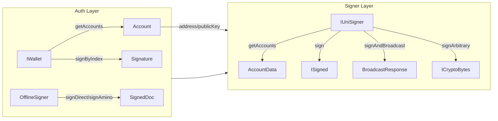

# Auth vs. Wallet vs. Signer: A Comparison

This document provides an overview and comparison of `Auth`, `Wallet`, and `Signer`, three core abstractions used for cryptographic operations and transaction signing in the InterchainJS ecosystem. Each serves a specific purpose in the signing workflow and has distinct characteristics and functionalities.

## 1. Auth Layer

The Auth layer provides the foundational cryptographic capabilities for account management and signing operations. It consists of two main abstractions:

### IWallet Interface

`IWallet` is the primary interface for managing cryptographic accounts and performing low-level signing operations:

- **Account Management**: Provides access to multiple accounts through `getAccounts()` and `getAccountByIndex()`
- **Direct Signing**: Offers `signByIndex()` method to sign arbitrary binary data using a specific account
- **Network Agnostic**: Designed to work across different blockchain networks with configurable address derivation strategies

### OfflineSigner Interface

`OfflineSigner` provides a secure way to sign transactions without exposing private keys:

- **External Wallet Integration**: Designed for integration with external wallets like Keplr, Leap, or hardware wallets
- **Document Signing**: Supports both Direct (protobuf) and Amino (JSON) signing modes through `OfflineDirectSigner` and `OfflineAminoSigner`
- **Privacy Preservation**: Keeps private keys secure within the external wallet while providing signing capabilities

## 2. Wallet Implementations

Wallet implementations provide concrete realizations of the `IWallet` interface, offering HD (Hierarchical Deterministic) key derivation and network-specific address generation:

### Secp256k1HDWallet

The primary wallet implementation for secp256k1 cryptography:

- **HD Key Derivation**: Supports BIP-32/BIP-44 hierarchical deterministic key derivation from mnemonic phrases
- **Multi-Account Support**: Can manage multiple accounts with different derivation paths
- **Network Compatibility**: Works across Cosmos, Ethereum, and Injective networks with appropriate address strategies
- **Offline Signer Conversion**: Can be converted to `OfflineDirectSigner` or `OfflineAminoSigner` for external wallet compatibility

### Network-Specific Variants

- **Cosmos**: `Secp256k1HDWallet` with bech32 address encoding
- **Ethereum**: `Secp256k1HDWallet` with keccak256 hashing and hex address format
- **Injective**: `EthSecp256k1HDWallet` with Ethereum-style addresses but Cosmos transaction format

## 3. Signer Layer

The Signer layer provides the highest-level abstraction for transaction signing and broadcasting, implementing the `IUniSigner` interface. Signers can be constructed from either `IWallet` implementations or `OfflineSigner` interfaces.

### IUniSigner Interface

The universal signer interface provides a consistent API across all blockchain networks:

- **Account Management**: `getAccounts()` returns account information including addresses and public keys
- **Transaction Workflow**: `sign()` creates signed transactions, `broadcast()` submits them to the network, and `signAndBroadcast()` combines both operations
- **Arbitrary Signing**: `signArbitrary()` signs raw binary data for authentication purposes
- **Network Abstraction**: Generic type parameters allow network-specific customization while maintaining a unified interface

### Network-Specific Implementations

- **Cosmos Signers**: `DirectSigner` and `AminoSigner` for protobuf and JSON signing modes
- **Ethereum Signers**: `LegacySigner` and `Eip1559Signer` for different transaction types
- **Injective Signers**: Cosmos-compatible signers with Ethereum-style address derivation

### Construction Patterns

Signers can be constructed in multiple ways:

1. **From IWallet**: Direct construction with full private key access
2. **From OfflineSigner**: Construction for external wallet integration
3. **Configuration-based**: Using network-specific configuration objects

## Summary

The three-layer architecture provides clear separation of concerns:

- **Auth Layer**: Foundational cryptographic operations and account management
- **Wallet Layer**: HD key derivation and network-specific address generation
- **Signer Layer**: High-level transaction signing and broadcasting with network abstraction

This design allows developers to choose the appropriate abstraction level based on their security requirements, from low-level cryptographic control to high-level transaction management, while maintaining compatibility across different blockchain networks.
