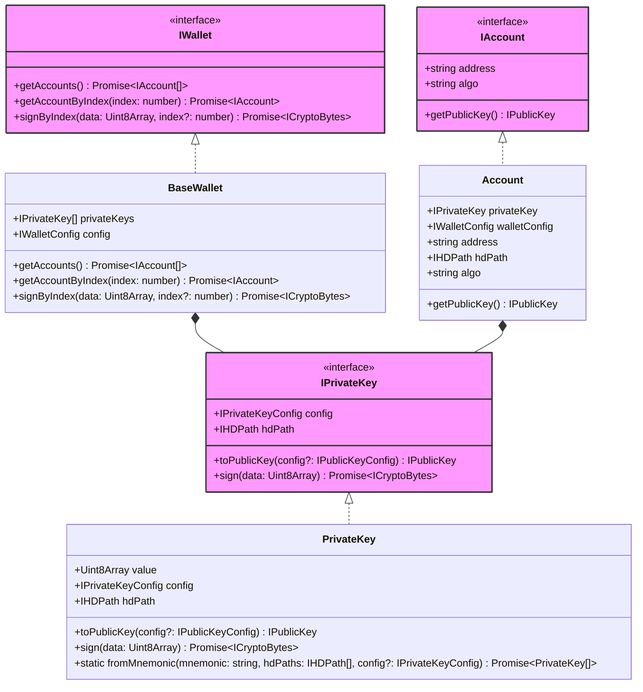

# Auth

The `@interchainjs/auth` package provides foundational cryptographic capabilities for blockchain applications, offering wallet implementations and account management across different cryptographic algorithms including `secp256k1` and `ethSecp256k1`. The package exposes consistent interfaces that allow signers to work with different algorithms without needing to know the underlying implementation details.



## Core Interfaces

### IWallet Interface

The `IWallet` interface provides the primary abstraction for managing cryptographic accounts:

- `getAccounts()`: Returns all accounts managed by this wallet
- `getAccountByIndex(index)`: Gets a specific account by its index
- `signByIndex(data, index)`: Signs arbitrary binary data using the specified account

### IAccount Interface

The `IAccount` interface represents a single cryptographic account:

- `address`: The blockchain address for this account
- `algo`: The cryptographic algorithm used (e.g., 'secp256k1')
- `getPublicKey()`: Returns the public key for this account

### IPrivateKey Interface

The `IPrivateKey` interface handles private key operations:

- `toPublicKey()`: Derives the corresponding public key
- `sign(data)`: Signs binary data and returns a cryptographic signature
- `fromMnemonic()`: Static method to derive private keys from mnemonic phrases

## Usage Patterns

### Creating Wallets from Mnemonic

```typescript
import { PrivateKey, BaseWallet } from '@interchainjs/auth';
import { HDPath } from '@interchainjs/types';

// Create private keys from mnemonic
const mnemonic = "your twelve word mnemonic phrase here";
const hdPaths = [HDPath.cosmos(0, 0, 0)]; // m/44'/118'/0'/0/0
const privateKeys = await PrivateKey.fromMnemonic(mnemonic, hdPaths);

// Create wallet with configuration
const wallet = new BaseWallet(privateKeys, config);
```

The auth layer is designed to be:

- **Algorithm Agnostic**: Works with different cryptographic algorithms (secp256k1, ed25519, etc.)
- **Network Independent**: Can be used across different blockchain networks
- **Configurable**: Supports different address derivation strategies and signature formats

See [usage examples](/docs/advanced/signer.md#signer--auth) for integration with signers.

## Wallet vs. OfflineSigner

### IWallet Implementations

`IWallet` implementations provide direct access to private keys and full cryptographic control:

- **Direct Key Access**: Can sign arbitrary data and perform any cryptographic operation
- **Multi-Account Management**: Manages multiple accounts with different derivation paths
- **Network Flexibility**: Can be configured for different blockchain networks

### OfflineSigner Interfaces

`OfflineSigner` interfaces provide secure signing without exposing private keys:

- **External Wallet Integration**: Designed for browser wallets like Keplr, Leap, or hardware wallets
- **Limited Scope**: Only supports specific document signing (Direct or Amino modes)
- **Enhanced Security**: Private keys remain in the external wallet environment

## Integration with Signers

The auth layer integrates seamlessly with the signer layer:

### IWallet Integration

```typescript
import { DirectSigner } from '@interchainjs/cosmos';
import { Secp256k1HDWallet } from '@interchainjs/cosmos/wallets/secp256k1hd';

// Create wallet
const wallet = await Secp256k1HDWallet.fromMnemonic(mnemonic, derivations);

// Use with signer
const signer = new DirectSigner(wallet, config);
```

### OfflineSigner Integration

```typescript
import { DirectSigner } from '@interchainjs/cosmos';

// Get offline signer from external wallet (e.g., Keplr)
const offlineSigner = await window.keplr.getOfflineSigner(chainId);

// Use with signer
const signer = new DirectSigner(offlineSigner, config);
```

### Flexibility Benefits

- **Development**: Use `IWallet` for full control during development and testing
- **Production**: Use `OfflineSigner` for secure integration with user wallets
- **Compatibility**: Both approaches work with the same signer interfaces

This design allows developers to choose the appropriate security model while maintaining consistent APIs across different usage scenarios.

See [signer documentation](/docs/advanced/signer.md) for detailed integration examples.
