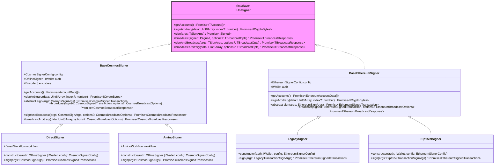
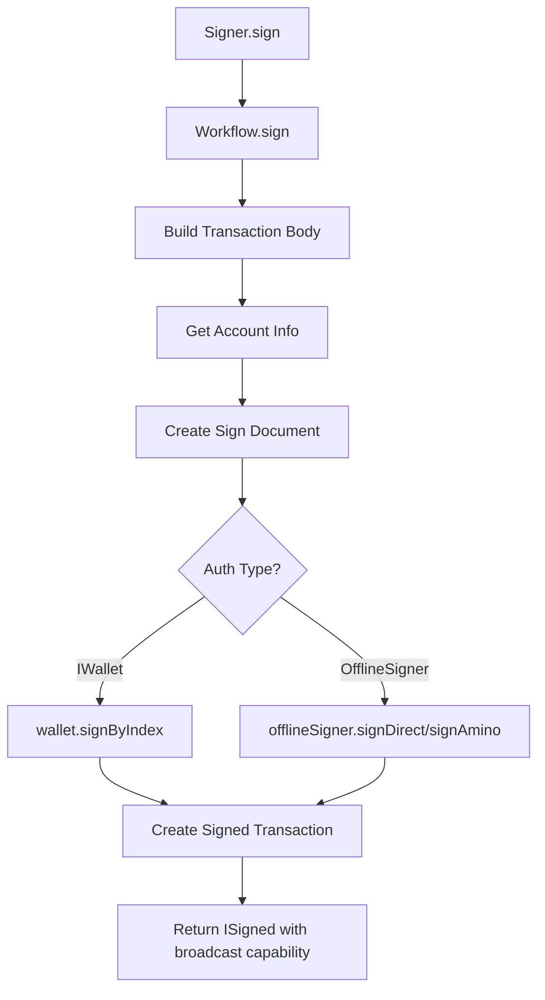

# Signer

The signer packages (`@interchainjs/cosmos`, `@interchainjs/ethereum`, `@interchainjs/injective`) provide high-level transaction signing and broadcasting capabilities for different blockchain networks. All signers implement the [`IUniSigner` interface](#iunisigner-interface) and extend network-specific base classes, allowing them to work with both `IWallet` implementations and `OfflineSigner` interfaces.

## Architecture Overview



## Transaction Workflow



## Core Concepts

The signer layer provides a unified interface for transaction signing and broadcasting across different blockchain networks. Key concepts include:

- **Network Abstraction**: The `IUniSigner` interface provides consistent methods regardless of the underlying blockchain
- **Flexible Authentication**: Signers work with both `IWallet` (direct key access) and `OfflineSigner` (external wallet) authentication
- **Transaction Lifecycle**: Complete transaction flow from message creation to broadcasting and confirmation
- **Type Safety**: Generic type parameters ensure type safety for network-specific transaction formats

## Signer + IWallet

IWallet implementations provide direct access to private keys for full cryptographic control. This approach is ideal for development, testing, and applications that manage their own key security.

### Usage with IWallet

```typescript
import { DirectSigner } from '@interchainjs/cosmos';
import { Secp256k1HDWallet } from '@interchainjs/cosmos/wallets/secp256k1hd';
import { HDPath } from '@interchainjs/types';

// Create wallet from mnemonic
const wallet = await Secp256k1HDWallet.fromMnemonic(
  "<MNEMONIC_WORDS>",
  [{
    prefix: "cosmos",
    hdPath: HDPath.cosmos(0, 0, 0).toString(), // m/44'/118'/0'/0/0
  }]
);

// Create signer with wallet
const signer = new DirectSigner(wallet, {
  chainId: 'cosmoshub-4',
  queryClient: queryClient,
  addressPrefix: 'cosmos'
});
```

## Signer + OfflineSigner

OfflineSigner interfaces provide secure integration with external wallets without exposing private keys. This approach is ideal for production applications that need to integrate with user wallets.

### Usage with OfflineSigner

```typescript
import { DirectSigner } from '@interchainjs/cosmos';

// Get offline signer from external wallet (e.g., Keplr)
await window.keplr.enable(chainId);
const offlineSigner = window.keplr.getOfflineSigner(chainId);

// Create signer with offline signer
const signer = new DirectSigner(offlineSigner, {
  chainId: 'cosmoshub-4',
  queryClient: queryClient,
  addressPrefix: 'cosmos'
});
```

### Benefits of OfflineSigner

- **Enhanced Security**: Private keys remain in the external wallet
- **User Control**: Users maintain full control over their keys
- **Standard Integration**: Works with popular wallets like Keplr, Leap, and hardware wallets

## IUniSigner Interface

The `IUniSigner` interface provides a universal API for transaction signing and broadcasting across different blockchain networks:

```typescript
/** Import from @interchainjs/types */
export interface IUniSigner<
  TTxResp = unknown,
  TAccount extends IAccount = IAccount,
  TSignArgs = unknown,
  TBroadcastOpts = unknown,
  TBroadcastResponse extends IBroadcastResult<TTxResp> = IBroadcastResult<TTxResp>,
> {
  // Account management
  getAccounts(): Promise<readonly TAccount[]>;

  // Core signing methods
  signArbitrary(data: Uint8Array, index?: number): Promise<ICryptoBytes>;

  // Transaction flow
  sign(args: TSignArgs): Promise<ISigned<TBroadcastOpts, TBroadcastResponse>>;
  broadcast(signed: ISigned<TBroadcastOpts, TBroadcastResponse>, options?: TBroadcastOpts): Promise<TBroadcastResponse>;
  signAndBroadcast(args: TSignArgs, options?: TBroadcastOpts): Promise<TBroadcastResponse>;

  // Raw broadcast (for pre-signed transactions)
  broadcastArbitrary(data: Uint8Array, options?: TBroadcastOpts): Promise<TBroadcastResponse>;
}
```

### Key Methods

- **`getAccounts()`**: Returns all accounts managed by this signer
- **`signArbitrary()`**: Signs arbitrary binary data for authentication purposes (e.g., login challenges)
- **`sign()`**: Signs transaction arguments and returns a signed transaction with broadcast capability
- **`broadcast()`**: Broadcasts a previously signed transaction to the network
- **`signAndBroadcast()`**: Combines signing and broadcasting in a single operation
- **`broadcastArbitrary()`**: Broadcasts raw transaction bytes to the network

> The interface uses generic type parameters to ensure type safety while maintaining network compatibility.

## Network-Specific Implementations

### Cosmos Network

#### DirectSigner
- **Import**: `import { DirectSigner } from '@interchainjs/cosmos'`
- **Signing Mode**: SIGN_MODE_DIRECT (protobuf)
- **Sign Args**: `CosmosSignArgs`
- **Transaction**: `TxRaw`
- **Wallet**: `Secp256k1HDWallet`
- **Account**: `AccountData`

#### AminoSigner
- **Import**: `import { AminoSigner } from '@interchainjs/cosmos'`
- **Signing Mode**: SIGN_MODE_LEGACY_AMINO_JSON
- **Sign Args**: `CosmosSignArgs`
- **Transaction**: `TxRaw`
- **Wallet**: `Secp256k1HDWallet`
- **Account**: `AccountData`

### Ethereum Network

#### LegacySigner
- **Import**: `import { LegacySigner } from '@interchainjs/ethereum'`
- **Transaction Type**: Legacy Ethereum transactions
- **Sign Args**: `LegacyTransactionSignArgs`
- **Transaction**: `EthereumTransaction`
- **Wallet**: `Secp256k1HDWallet`
- **Account**: `EthereumAccountData`

#### Eip1559Signer
- **Import**: `import { Eip1559Signer } from '@interchainjs/ethereum'`
- **Transaction Type**: EIP-1559 transactions with dynamic fees
- **Sign Args**: `Eip1559TransactionSignArgs`
- **Transaction**: `EthereumTransaction`
- **Wallet**: `Secp256k1HDWallet`
- **Account**: `EthereumAccountData`

### Injective Network

#### DirectSigner
- **Import**: `import { DirectSigner } from '@interchainjs/injective'`
- **Signing Mode**: SIGN_MODE_DIRECT (Cosmos-compatible)
- **Sign Args**: `InjectiveSignArgs`
- **Transaction**: `TxRaw`
- **Wallet**: `EthSecp256k1HDWallet`
- **Account**: `AccountData`

#### AminoSigner
- **Import**: `import { AminoSigner } from '@interchainjs/injective'`
- **Signing Mode**: SIGN_MODE_LEGACY_AMINO_JSON (Cosmos-compatible)
- **Sign Args**: `InjectiveSignArgs`
- **Transaction**: `TxRaw`
- **Wallet**: `EthSecp256k1HDWallet`
- **Account**: `AccountData`
