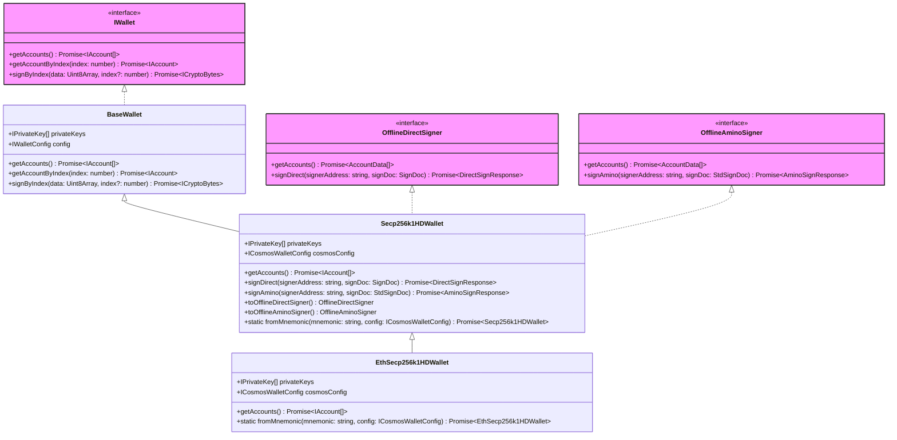

# Wallet

Wallets in InterchainJS provide HD (Hierarchical Deterministic) key management and account creation capabilities. They implement the `IWallet` interface and can be used directly with signers or converted to `OfflineSigner` interfaces for external wallet compatibility.

- See [Auth vs. Wallet vs. Signer](/docs/advanced/auth-wallet-signer.md) for architectural overview
- See [Auth documentation](/docs/advanced/auth.md) for interface details

## Architecture



## Wallet Implementations

### Secp256k1HDWallet (Cosmos)

The primary HD wallet implementation for Cosmos-based networks:

```typescript
import { Secp256k1HDWallet } from '@interchainjs/cosmos';
import { HDPath } from '@interchainjs/types';

// Create wallet with multiple accounts
const wallet = await Secp256k1HDWallet.fromMnemonic(
  "<MNEMONIC_WORDS>",
  {
    derivations: [
      {
        prefix: "cosmos",
        hdPath: HDPath.cosmos(0, 0, 0).toString(), // m/44'/118'/0'/0/0
      },
      {
        prefix: "cosmos",
        hdPath: HDPath.cosmos(0, 0, 1).toString(), // m/44'/118'/0'/0/1
      }
    ]
  }
);
```

### EthSecp256k1HDWallet (Injective)

HD wallet implementation for Injective network with Ethereum-style addresses:

```typescript
import { EthSecp256k1HDWallet } from '@interchainjs/injective';
import { HDPath } from '@interchainjs/types';

// Create wallet for Injective
const wallet = await EthSecp256k1HDWallet.fromMnemonic(
  "<MNEMONIC_WORDS>",
  {
    derivations: [{
      prefix: "inj",
      hdPath: HDPath.ethereum(0, 0, 0).toString(), // m/44'/60'/0'/0/0
    }]
  }
);
```

## OfflineSigner Conversion

Wallets can be converted to `OfflineSigner` interfaces for external wallet compatibility:

```typescript
// Convert to OfflineDirectSigner
const directSigner = wallet.toOfflineDirectSigner();
const accounts = await directSigner.getAccounts();
console.log('Address:', accounts[0].address);

// Convert to OfflineAminoSigner
const aminoSigner = wallet.toOfflineAminoSigner();
```

## Usage with Signers

Wallets integrate seamlessly with signers:

```typescript
import { DirectSigner } from '@interchainjs/cosmos';

// Direct usage with signer
const signer = new DirectSigner(wallet, {
  chainId: 'cosmoshub-4',
  queryClient: queryClient,
  addressPrefix: 'cosmos'
});

// Or use as OfflineSigner
const offlineSigner = wallet.toOfflineDirectSigner();
const signerFromOffline = new DirectSigner(offlineSigner, config);
```

This flexibility allows developers to choose between direct wallet usage (full control) and offline signer usage (external wallet compatibility) based on their security requirements.
