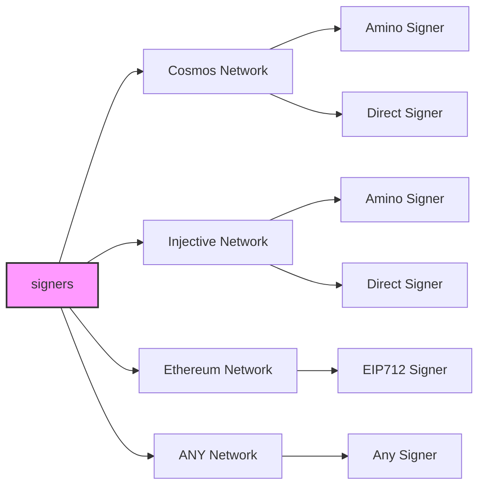
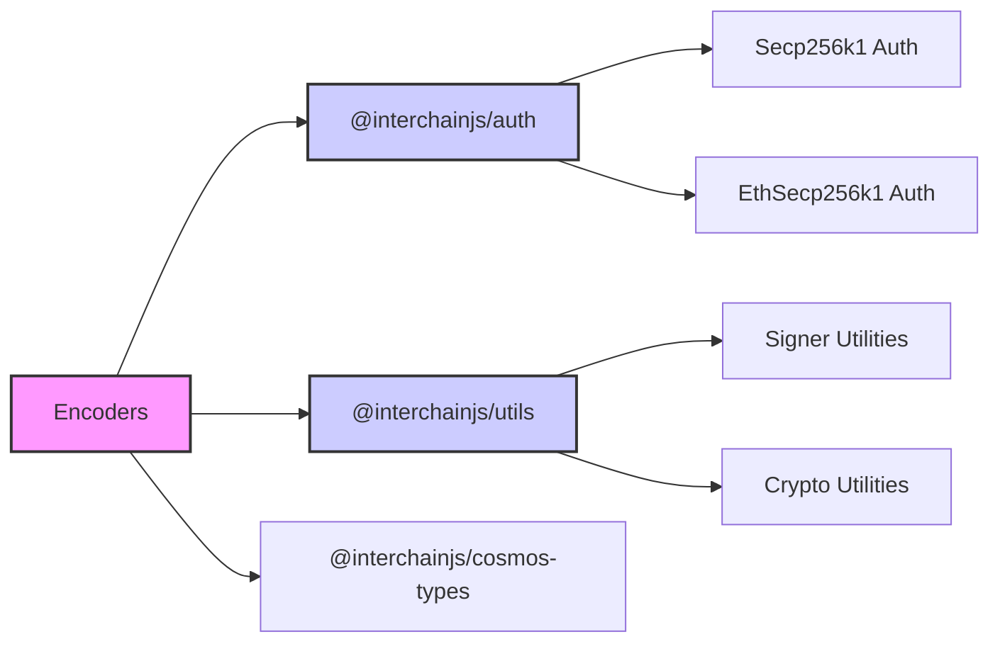

# InterchainJS

<p align="center">
  
</p>

<p align="center" width="100%">
  <a href="https://github.com/hyperweb-io/interchainjs/actions/workflows/run-tests.yaml">
    
  </a>
   <a href="https://github.com/hyperweb-io/interchainjs/blob/main/LICENSE-MIT"></a>
   <a href="https://github.com/hyperweb-io/interchainjs/blob/main/LICENSE-Apache"></a>
</p>

A single, universal signing interface for any network. Birthed from the interchain ecosystem for builders. Create adapters for any Web3 network.

## install

```sh
npm install interchainjs
```

## Table of Contents

- [InterchainJS](#interchainjs)
- [Install](#install)
- [Introduction](#interchainjs-universal-signing-for-web3)
- [Overview](#overview)
- [Tutorials & Documentation](#tutorials--documentation)
  - [RPC Clients](#rpc-clients)
  - [Tree Shakable Helpers](#tree-shakable-helpers)
  - [Module-Specific Helpers](#module-specific-helpers)
- [Connecting with Wallets and Signing Messages](#connecting-with-wallets-and-signing-messages)
  - [Initializing the Signing Client](#initializing-the-signing-client)
  - [Creating Signers](#creating-signers)
  - [Broadcasting Messages](#broadcasting-messages)
  - [All In One Example](#all-in-one-example)
- [Amino Helpers](#amino-helpers)
- [Auth](#auth)
- [Crypto Helpers](#crypto-helpers)
- [Encoding Helpers](#encoding-helpers)
- [Math Helpers](#math-helpers)
- [Pubkey Helpers](#pubkey-helpers)
- [Supported Networks](#supported-networks)
  - [Cosmos Network](#cosmos-network)
  - [Injective Network](#injective-network)
  - [Ethereum Network](#ethereum-network)
- [Developing](#developing)
  - [Codegen](#codegen)
- [Interchain JavaScript Stack ⚛️](#interchain-javascript-stack-️)
- [Credits](#credits)
- [Disclaimer](#disclaimer)

## InterchainJS: Universal Signing for Web3

[InterchainJS](https://hyperweb.io/stack/interchainjs) is a **universal signing interface** designed for seamless interoperability across blockchain networks. It is one of the **core libraries of the [Interchain JavaScript Stack](https://hyperweb.io/stack)**, a modular framework that brings Web3 development to millions of JavaScript developers.

At its core, InterchainJS provides a **flexible adapter pattern** that abstracts away blockchain signing complexities, making it easy to integrate new networks, manage accounts, and support diverse authentication protocols and signing algorithms—all in a unified, extensible framework.

## Overview

InterchainJS sits at the foundation of the **[Interchain JavaScript Stack](https://hyperweb.io/stack)**, a set of tools that work together like nested building blocks:

- **[InterchainJS](https://hyperweb.io/stack/interchainjs)** → Powers signing across Cosmos, Ethereum (EIP-712), and beyond.
- **[Interchain Kit](https://hyperweb.io/stack/interchain-kit)** → Wallet adapters that connect dApps to multiple blockchain networks.
- **[Interchain UI](https://hyperweb.io/stack/interchain-ui)** → A flexible UI component library for seamless app design.
- **[Create Interchain App](https://hyperweb.io/stack/create-interchain-app)** → A developer-friendly starter kit for cross-chain applications.

This modular architecture ensures **compatibility, extensibility, and ease of use**, allowing developers to compose powerful blockchain applications without deep protocol-specific knowledge.

### Visualizing InterchainJS Components

The diagram below illustrates how InterchainJS connects different signer types to various network classes, showcasing its adaptability for a wide range of blockchain environments.





---

## Tutorials & Documentation

The following resources provide comprehensive guidance for developers working with InterchainJS. Whether you're setting up a new application, implementing custom signers, or exploring advanced features, these tutorials and documentation will help you leverage the full power of InterchainJS across various blockchain networks.

| Topic                        | Documentation                                                                 |
| ---------------------------- | ----------------------------------------------------------------------------- |
| **Create Interchain App**    | [Create Interchain App](https://github.com/hyperweb-io/create-interchain-app) |
| **Building a Custom Signer** | [Building a Custom Signer](/docs/building-a-custom-signer.md)                 |
| **Advanced Documentation**   | [View Docs](/docs/)                                                           |

### RPC Clients

RPC (Remote Procedure Call) clients enable communication between your application and blockchain networks. InterchainJS provides a flexible and type-safe way to create these clients, allowing you to query blockchain data with minimal configuration. The following example demonstrates how to create and use an RPC client to query data from a Cosmos-based blockchain.

```js
import { createQueryRpc } from "@interchainjs/cosmos/utils";
import { createGetAllBalances } from "@interchainjs/cosmos/bank/v1beta1/query.rpc.func";

{ getRpcEndpoint } = useChain("cosmoshub");

const endpoint = await getRpcEndpoint();
const rpc = createQueryRpc(endpoint);

// get the tree shakable helper functions using the rpc client
const getAllBalances = createGetAllBalances(rpc);

// now you can query the cosmos modules
const balance = await getAllBalances({
  address: "cosmos1addresshere",
});
```

### Tree Shakable Helpers

InterchainJS provides tree shakable helper functions to optimize your application's bundle size. These helpers follow a factory pattern that allows modern JavaScript bundlers to eliminate unused code through tree shaking. These helpers improve modularity and optimize performance by allowing you to import only the functionality you need.
Tree shakable tutorial video: https://youtu.be/3dRm9HEklMo

#### How Tree Shakable Helpers Work

Each helper function is individually exported using a `create*` prefix (e.g., `createGetAllBalances`).
This pattern enables:

1. **Bundle Size Optimization**: Only the functions you import and use are included in your final bundle
2. **Lazy Initialization**: Helper functions are only constructed when explicitly called
3. **Customizable Configuration**: Each helper can be configured with specific parameters

For example, query helpers are functions that return other functions, constructed with specific parameters:

```js
// Import only what you need
import { createQueryRpc } from "@interchainjs/cosmos/utils";
import { createGetAllBalances } from "@interchainjs/cosmos/bank/v1beta1/query.rpc.func";

// Initialize RPC client
const rpc = createQueryRpc(endpoint);

// Create the specific helper function you need
const getAllBalances = createGetAllBalances(rpc);

// Now you can query the blockchain
const balance = await getAllBalances({
  address: "cosmos1addresshere",
});
```

#### Available Helper Types

InterchainJS provides two main types of tree shakable helpers:

1. **Query Helpers**: For retrieving data from the blockchain

   ```js
   import { createGetValidator } from "@interchainjs/cosmos/staking/v1beta1/query.rpc.func";
   ```

2. **Transaction Helpers**: For broadcasting transactions

   ```js
   import { createDelegate } from "@interchainjs/cosmos/staking/v1beta1/tx.rpc.func";
   ```

#### Example: Combining Query and Transaction Helpers

Here's how you might use both types together in a staking scenario:

```js
// Import helpers
import { createQueryRpc } from "@interchainjs/cosmos/utils";
import { createGetValidator } from "@interchainjs/cosmos/staking/v1beta1/query.rpc.func";
import { createDelegate } from "@interchainjs/cosmos/staking/v1beta1/tx.rpc.func";

// Setup query client
const rpc = createQueryRpc(endpoint);
const getValidator = createGetValidator(rpc);

// Query validator info
const { validator } = await getValidator({
  validatorAddr: "cosmosvaloper1...",
});

// Setup transaction function
const delegate = createDelegate(signingClient);

// Execute delegation
const result = await delegate(
  signerAddress,
  {
    delegatorAddress: signerAddress,
    validatorAddress: validator.operatorAddress,
    amount: { denom: "uatom", amount: "1000000" },
  },
  fee,
  "Delegation via InterchainJS"
);
```

By importing only the specific helpers you need, you ensure that your application bundle remains as small and efficient as possible.

#### Framework Integration

These tree shakable helpers can be used with framework-specific implementations:

- **React**: Available as hooks in `@interchainjs/react`

  ```js
  import { useGetAllBalances } from "@interchainjs/react/cosmos/bank/v1beta1/query.rpc.react";
  ```

- **Vue**: Available as composables in `@interchainjs/vue`

  ```js
  import { useGetAllBalances } from "@interchainjs/vue/cosmos/bank/v1beta1/query.rpc.vue";
  ```

#### Examples and Documentation

For detailed usage examples and implementation patterns, refer to the test suite in the [starship/**tests**](https://github.com/hyperweb-io/interchainjs/tree/main/libs/interchainjs/starship/__tests__) directory.

#### Module-Specific Helpers

The following sections provide import examples for various Cosmos SDK modules.

##### Authz

```js
// query helpers
import {
  createGetGrants,
  createGetGranterGrants,
  createGetGranteeGrants,
} from "@interchainjs/cosmos/authz/v1beta1/query.rpc.func";

// tx helpers
import {
  createGrant,
  createRevoke,
  createExec,
} from "@interchainjs/cosmos/authz/v1beta1/tx.rpc.func";
```

##### Bank

```js
// query helpers
import {
  createGetAllBalances,
  createGetDenomMetadata,
  createGetSupply,
  createGetParams,
} from "@interchainjs/cosmos/bank/v1beta1/query.rpc.func";

// tx helpers
import {
  createSend,
  createMultiSend,
} from "@interchainjs/cosmos/bank/v1beta1/tx.rpc.func";
```

##### Circuit

```js
// query helpers
import {
  createGetAccount,
  createGetAccounts,
  createGetDisabledList,
} from "@interchainjs/cosmos/circuit/v1/query.rpc.func";

// tx helpers
import {
  createAuthorizeCircuitBreaker,
  createTripCircuitBreaker,
  createResetCircuitBreaker,
} from "@interchainjs/cosmos/circuit/v1/tx.rpc.func";
```

##### Consensus

```js
// query helpers
import { createGetParams } from "@interchainjs/cosmos/consensus/v1/query.rpc.func";

// tx helpers
import { createUpdateParams } from "@interchainjs/cosmos/consensus/v1/tx.rpc.func";
```

##### Crisis

```js
// tx helpers
import {
  createVerifyInvariant,
  createUpdateParams,
} from "@interchainjs/cosmos/crisis/v1beta1/tx.rpc.func";
```

##### Distribution

```js
// query helpers
import {
  createGetParams,
  createGetValidatorDistributionInfo,
  createGetValidatorOutstandingRewards,
  createGetValidatorCommission,
  createGetValidatorSlashes,
  createGetDelegationRewards,
  createGetDelegationTotalRewards,
} from "@interchainjs/cosmos/distribution/v1beta1/query.rpc.func";

// tx helpers
import {
  createSetWithdrawAddress,
  createWithdrawDelegatorReward,
  createWithdrawValidatorCommission,
  createFundCommunityPool,
  createCommunityPoolSpend,
  createUpdateParams,
} from "@interchainjs/cosmos/distribution/v1beta1/tx.rpc.func";
```

##### Evidence

```js
// query helpers
import {
  createGetEvidence,
  createGetAllEvidence,
} from "@interchainjs/cosmos/evidence/v1beta1/query.rpc.func";

// tx helpers
import { createSubmitEvidence } from "@interchainjs/cosmos/evidence/v1beta1/tx.rpc.func";
```

##### Feegrant

```js
// query helpers
import {
  createGetAllowance,
  createGetAllowances,
  createGetAllowancesByGranter,
} from "@interchainjs/cosmos/feegrant/v1beta1/query.rpc.func";

// tx helpers
import {
  createGrantAllowance,
  createRevokeAllowance,
  createPruneAllowances,
} from "@interchainjs/cosmos/feegrant/v1beta1/tx.rpc.func";
```

##### Gov

```js
// query helpers
import {
  createGetProposal,
  createGetProposals,
  createGetVote,
  createGetVotes,
  createGetParams,
  createGetDeposit,
  createGetDeposits,
  createGetTallyResult,
} from "@interchainjs/cosmos/gov/v1beta1/query.rpc.func";

// tx helpers
import {
  createSubmitProposal,
  createDeposit,
  createVote,
  createVoteWeighted,
} from "@interchainjs/cosmos/gov/v1beta1/tx.rpc.func";
```

##### Group

```js
// query helpers
import {
  createGetGroupInfo,
  createGetGroupPolicyInfo,
  createGetGroupMembers,
  createGetGroupsByAdmin,
  createGetGroupPoliciesByGroup,
  createGetGroupPoliciesByAdmin,
} from "@interchainjs/cosmos/group/v1/query.rpc.func";

// tx helpers
import {
  createCreateGroup,
  createUpdateGroupMetadata,
  createUpdateGroupMembers,
  createUpdateGroupAdmin,
  createUpdateGroupPolicyMetadata,
  createSubmitProposal,
  createVote,
  createExec,
} from "@interchainjs/cosmos/group/v1/tx.rpc.func";
```

##### Mint

```js
// query helpers
import {
  createGetParams,
  createGetInflation,
  createGetAnnualProvisions,
} from "@interchainjs/cosmos/mint/v1beta1/query.rpc.func";

// tx helpers
import { createUpdateParams } from "@interchainjs/cosmos/mint/v1beta1/tx.rpc.func";
```

##### Nft

```js
// query helpers
import {
  createGetBalance,
  createGetOwner,
  createGetClass,
  createGetClasses,
  createGetNFTs,
  createGetNFT,
} from "@interchainjs/cosmos/nft/v1/query.rpc.func";

// tx helpers
import { createSend } from "@interchainjs/cosmos/nft/v1/tx.rpc.func";
```

##### Staking

```js
// query helpers
import {
  createGetValidators,
  createGetValidator,
  createGetValidatorDelegations,
  createGetValidatorUnbondingDelegations,
  createGetDelegation,
  createGetUnbondingDelegation,
} from "@interchainjs/cosmos/staking/v1beta1/query.rpc.func";

// tx helpers
import {
  createCreateValidator,
  createEditValidator,
  createDelegate,
  createUndelegate,
  createRedelegate,
} from "@interchainjs/cosmos/staking/v1beta1/tx.rpc.func";
```

##### Vesting

```js
// tx helpers
import {
  createCreateVestingAccount,
  createCreatePermanentLockedAccount,
  createCreatePeriodicVestingAccount,
} from "@interchainjs/cosmos/vesting/v1beta1/tx.rpc.func";
```

##### CosmWasm

```js
// query helpers
import {
  createGetContractInfo,
  createGetContractHistory,
  createGetContractsByCode,
  createGetAllContractState,
  createGetRawContractState,
  createGetSmartContractState,
  createGetCode,
  createGetCodes,
} from "@interchainjs/cosmwasm/wasm/v1/query.rpc.func";

// tx helpers
import {
  createStoreCode,
  createInstantiateContract,
  createMigrateContract,
  createUpdateAdmin,
  createClearAdmin,
} from "@interchainjs/cosmwasm/wasm/v1/tx.rpc.func";
```

##### IBC

```js
// query helpers
import {
  createGetParams,
  createGetDenomHash,
  createGetEscrowAddress,
  createGetTotalEscrowForDenom,
} from "@interchainjs/ibc/applications/transfer/v1/query.rpc.func";

// tx helpers
import {
  createTransfer,
  createUpdateParams,
} from "@interchainjs/ibc/applications/transfer/v1/tx.rpc.func";
```

## Connecting with Wallets and Signing Messages

⚡️ For web interfaces, we recommend using [interchain-kit](https://github.com/hyperweb-io/interchain-kit/). Continue below to see how to manually construct signers and clients.

Here are the docs on [creating signers](https://github.com/hyperweb-io/interchain-kit/blob/main/packages/core/README.md) in interchain-kit that can be used with Keplr and other wallets.

### Initializing the Signing Client

Use SigningClient.connectWithSigner to get your `SigningClient`:

```js
import { SigningClient } from "@interchainjs/cosmos/signing-client";

const signingClient = await SigningClient.connectWithSigner(
  await getRpcEndpoint(),
  new AminoGenericOfflineSigner(aminoOfflineSigner)
);
```

### Creating Signers

To broadcast messages, you can create signers with a variety of options:

- [interchain-kit](https://github.com/hyperweb-io/interchain-kit/) (recommended)
- [keplr](https://docs.keplr.app/api/cosmjs.html)

### Broadcasting Messages

When you have your `signing client`, you can broadcast messages:

```js
const msg = {
  typeUrl: MsgSend.typeUrl,
  value: MsgSend.fromPartial({
    amount: [
      {
        denom: "uatom",
        amount: "1000",
      },
    ],
    toAddress: address,
    fromAddress: address,
  }),
};

const fee: StdFee = {
  amount: [
    {
      denom: "uatom",
      amount: "1000",
    },
  ],
  gas: "86364",
};
const response = await signingClient.signAndBroadcast(address, [msg], fee);
```

### All In One Example

For a comprehensive example of how to use InterchainJS to send messages, please see the example [here](https://github.com/hyperweb-io/create-interchain-app/tree/main/examples/authz). This example demonstrates how to:

- Initialize the client.
- Create and sign messages.
- Broadcast transactions.
- Handle responses and errors.

The example provides a complete walkthrough of setting up the client, creating a message for sending txs, and broadcasting the transaction to the chain.

---

## Amino Helpers

The `@interchainjs/amino` package provides utilities for working with Amino messages and types. It includes functions for encoding and decoding messages, as well as for creating and manipulating Amino types.

| Package                                          | Description                       |
| ------------------------------------------------ | --------------------------------- |
| [@interchainjs/amino](/packages/amino/README.md) | Amino message and type utilities. |

## Auth

The authentication module is universally applied across different networks.

| Package                                                                    | Description                                                                  |
| -------------------------------------------------------------------------- | ---------------------------------------------------------------------------- |
| [@interchainjs/auth](/packages/auth/README.md)                             | Handles authentication across blockchain networks.                           |
| [Advanced Docs: `Auth vs. Wallet vs. Signer`](/docs/auth-wallet-signer.md) | Explanation of the differences between authentication, wallets, and signers. |

## Crypto Helpers

The `@interchainjs/crypto` package provides utilities for working with cryptographic primitives. It includes functions for encoding and decoding messages, as well as for creating and manipulating Amino types.

| Package                                            | Description                        |
| -------------------------------------------------- | ---------------------------------- |
| [@interchainjs/crypto](/packages/crypto/README.md) | Crypto message and type utilities. |

## Encoding Helpers

The `@interchainjs/encoding` package provides utilities for working with encoding. It includes functions for encoding and decoding messages, as well as for creating and manipulating encoding types.

| Package                                                | Description                          |
| ------------------------------------------------------ | ------------------------------------ |
| [@interchainjs/encoding](/packages/encoding/README.md) | Encoding message and type utilities. |

## Math Helpers

The `@interchainjs/math` package provides utilities for working with math. It includes functions for encoding and decoding messages, as well as for creating and manipulating math types.

| Package                                        | Description                      |
| ---------------------------------------------- | -------------------------------- |
| [@interchainjs/math](/packages/math/README.md) | Math message and type utilities. |

## Pubkey Helpers

The `@interchainjs/pubkey` package provides utilities for working with pubkeys. It includes functions for encoding and decoding messages, as well as for creating and manipulating pubkey types.

| Package                                            | Description                        |
| -------------------------------------------------- | ---------------------------------- |
| [@interchainjs/pubkey](/packages/pubkey/README.md) | Pubkey message and type utilities. |

## Supported Networks

### Cosmos Network

| Feature                      | Package                                                       |
| ---------------------------- | ------------------------------------------------------------- |
| **Transactions**             | [@interchainjs/cosmos](/networks/cosmos/README.md)            |
| **Cosmos Types**             | [@interchainjs/cosmos-types](/networks/cosmos-msgs/README.md) |
| **Migration from `@cosmjs`** | [interchainjs](/networks/cosmjs/README.md)                    |

---

### Injective Network

| Feature          | Package                                                  |
| ---------------- | -------------------------------------------------------- |
| **Transactions** | [@interchainjs/injective](/networks/injective/README.md) |

---

### Ethereum Network

| Feature          | Package                                                |
| ---------------- | ------------------------------------------------------ |
| **Transactions** | [@interchainjs/ethereum](/networks/ethereum/README.md) |

---

## Developing

When first cloning the repo:

```shell
yarn
yarn build:dev
```

### Codegen

Contract schemas live in `./contracts`, and protos in `./proto`. Look inside of `scripts/interchainjs.telescope.json` and configure the settings for bundling your SDK and contracts into `interchainjs`:

```shell
yarn codegen
```

## Interchain JavaScript Stack ⚛️

A unified toolkit for building applications and smart contracts in the Interchain ecosystem

| Category                       | Tools                                                                                                                                                                                                     | Description                                                                                                         |
| ------------------------------ | --------------------------------------------------------------------------------------------------------------------------------------------------------------------------------------------------------- | ------------------------------------------------------------------------------------------------------------------- |
| **Chain Information**          | [**Chain Registry**](https://github.com/hyperweb-io/chain-registry), [**Utils**](https://www.npmjs.com/package/@chain-registry/utils), [**Client**](https://www.npmjs.com/package/@chain-registry/client) | Everything from token symbols, logos, and IBC denominations for all assets you want to support in your application. |
| **Wallet Connectors**          | [**Interchain Kit**](https://github.com/hyperweb-io/interchain-kit)<sup>beta</sup>, [**Cosmos Kit**](https://github.com/hyperweb-io/cosmos-kit)                                                           | Experience the convenience of connecting with a variety of web3 wallets through a single, streamlined interface.    |
| **Signing Clients**            | [**InterchainJS**](https://github.com/hyperweb-io/interchainjs)<sup>beta</sup>, [**CosmJS**](https://github.com/cosmos/cosmjs)                                                                            | A single, universal signing interface for any network                                                               |
| **SDK Clients**                | [**Telescope**](https://github.com/hyperweb-io/telescope)                                                                                                                                                 | Your Frontend Companion for Building with TypeScript with Cosmos SDK Modules.                                       |
| **Starter Kits**               | [**Create Interchain App**](https://github.com/hyperweb-io/create-interchain-app)<sup>beta</sup>, [**Create Cosmos App**](https://github.com/hyperweb-io/create-cosmos-app)                               | Set up a modern Interchain app by running one command.                                                              |
| **UI Kits**                    | [**Interchain UI**](https://github.com/hyperweb-io/interchain-ui)                                                                                                                                         | The Interchain Design System, empowering developers with a flexible, easy-to-use UI kit.                            |
| **Testing Frameworks**         | [**Starship**](https://github.com/hyperweb-io/starship)                                                                                                                                                   | Unified Testing and Development for the Interchain.                                                                 |
| **TypeScript Smart Contracts** | [**Create Hyperweb App**](https://github.com/hyperweb-io/create-hyperweb-app)                                                                                                                             | Build and deploy full-stack blockchain applications with TypeScript                                                 |
| **CosmWasm Contracts**         | [**CosmWasm TS Codegen**](https://github.com/CosmWasm/ts-codegen)                                                                                                                                         | Convert your CosmWasm smart contracts into dev-friendly TypeScript classes.                                         |

## Credits

🛠 Built by Hyperweb (formerly Cosmology) — if you like our tools, please checkout and contribute to [our github ⚛️](https://github.com/hyperweb-io)

## Disclaimer

AS DESCRIBED IN THE LICENSES, THE SOFTWARE IS PROVIDED "AS IS", AT YOUR OWN RISK, AND WITHOUT WARRANTIES OF ANY KIND.

No developer or entity involved in creating this software will be liable for any claims or damages whatsoever associated with your use, inability to use, or your interaction with other users of the code, including any direct, indirect, incidental, special, exemplary, punitive or consequential damages, or loss of profits, cryptocurrencies, tokens, or anything else of value.

```

```

```

```
